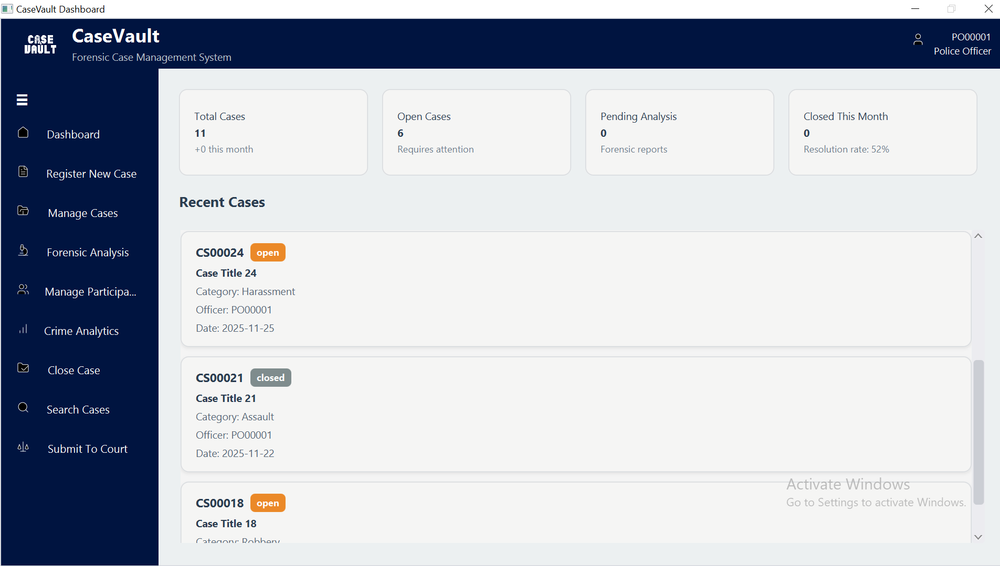
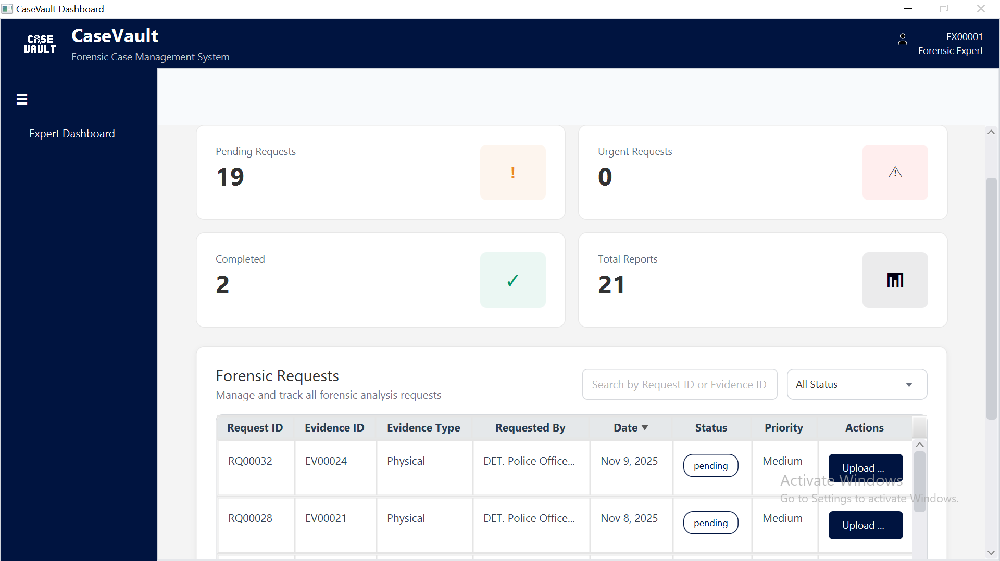
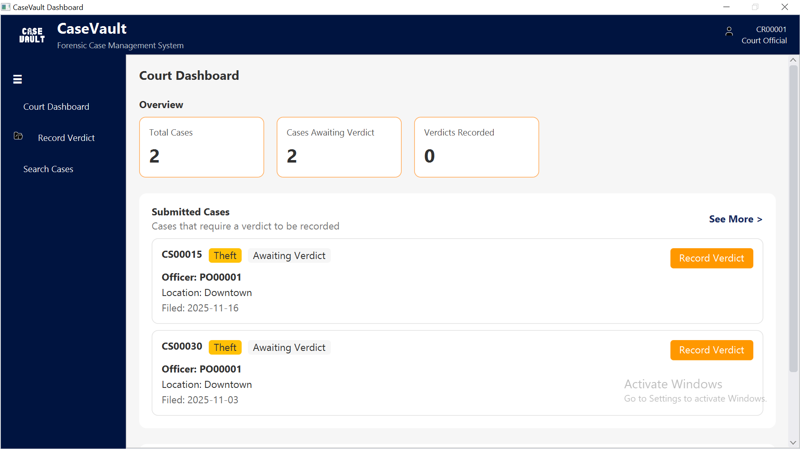
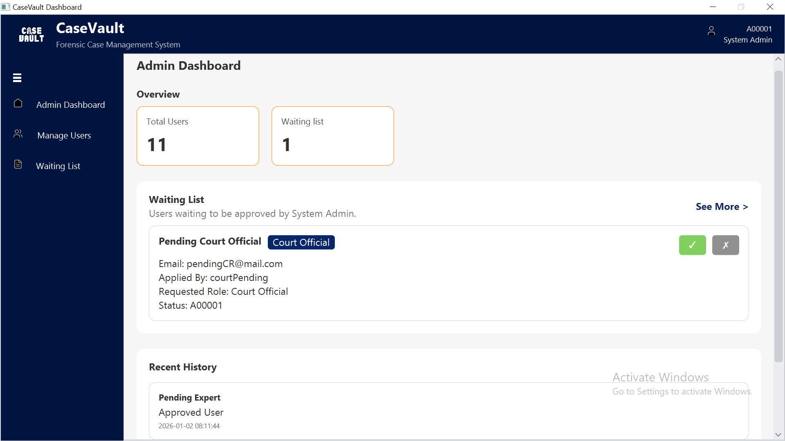
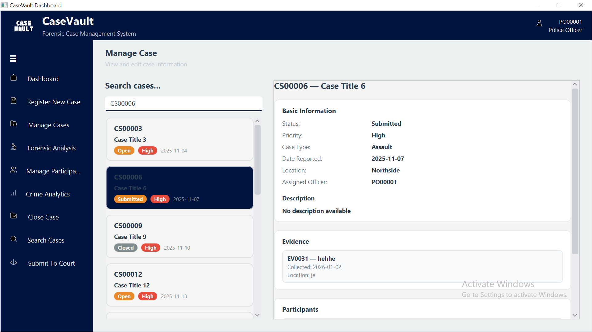
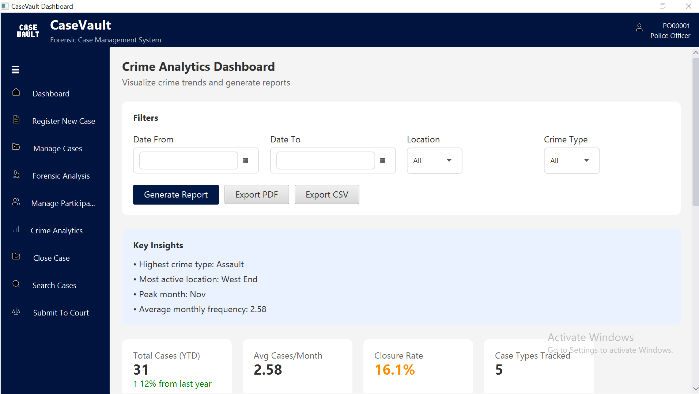
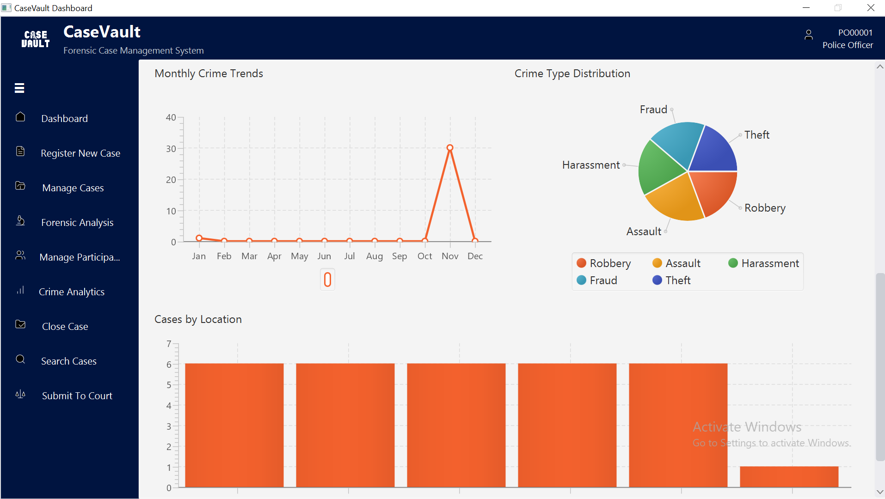

# 🗂️👮‍♀️ CaseVault – Forensic Case Management System

**CaseVault** is a secure forensic case management system designed to manage the complete criminal investigation lifecycle. It enables structured case handling, secure evidence tracking, forensic collaboration, and court integration through role-based access and a layered architecture.

---

## 🏸Features

* Case registration, tracking, search, and closure
* Secure digital & physical evidence logging with chain-of-custody
* Forensic analysis requests and report management
* Court case submission and verdict recording
* Participant profiling (victims, suspects)
* Crime analytics and visual reporting
* Role-based access control with audit trails

---

## 🕵️‍♂️ User Roles

| Role            | Key Permissions                                                            |
| --------------- | -------------------------------------------------------------------------- |
| Police Officer  | Manage cases, evidence, participants, forensic requests, court submissions |
| Forensic Expert | Upload forensic reports                                                    |
| Court Official  | Review cases, record verdicts                                              |
| System Admin    | Manage users and roles                                                     |

---

## ⚙ Tech Stack

* **Frontend:** JavaFX
* **Backend:** Java
* **Database:** SQLite
  
---

## 📷 Images

### Police Dashboard


### Expert Dashboard


### Court Official Dashboard


### Admin Dashboard



### Manage Cases


### Crime Analytics



***Run the project to view the complete project***

---

## ▶️ Getting Started

**Requirements:** JDK 8+, JavaFX, SQLite (embedded)

```bash
git clone https://github.com/FatimaSohailll/CaseVault-fcms.git
```

Open in an IDE and run the JavaFX main class.

---
